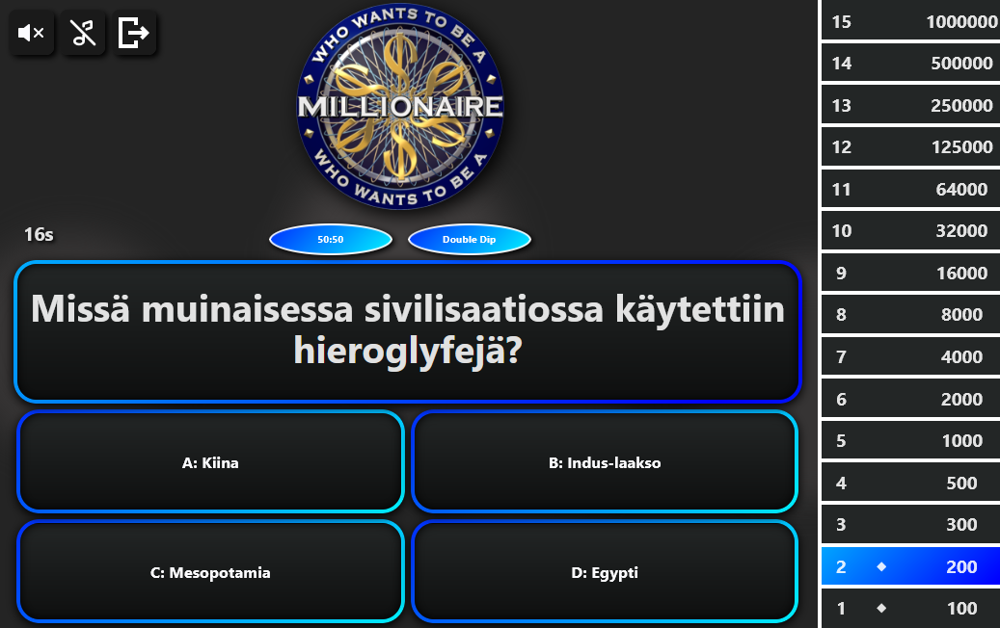

<h1 align="center"> React app - Who Wants to Be a Millionaire? </h1>
<p align="center"></p>

---

<h3>Questions & Answers:</h3>
<p>.json files are located at /src/questions/..</p>
<p>Example structure</p>

````
{
  "description": "Example questions",
  "questions": [
    {
    "question": "What is the sum of 1 + 1?",
    "answer": "2",
    "A": "1",
    "B": "2",
    "C": "3",
    "D": "4"
    },
    {
    "question": "How many days does january have?",
    "answer": "31",
    "A": "30",
    "B": "29",
    "C": "31",
    "D": "28"
    }
  ]
}
````

<p>This example contains only 2 questions, the minimum is 15+1 where 15 is for the game stage and 1 is for a lifeline(Reroll).</p>
<p>Description is displayed above the play button in the menu and in the dropdown menu in settings. Description also affects highscore filtering.</p>
<p>Adding new Q&A files does not automatically add them to the game, you have to edit App.tsx and add: (import filename from './questions/filename.json') and then edit: (const quizArray = [..., filename])</p>

---

<h3>Highscores:</h3>
<p>Highscores are saved locally on the browser localStorage, if cookies are cleared then highscores will also be cleared</p>
<p>Highscores can also be cleared manually this requires a password which by default is "root", this password can also be changed by editing /src/config/admin.json</p>